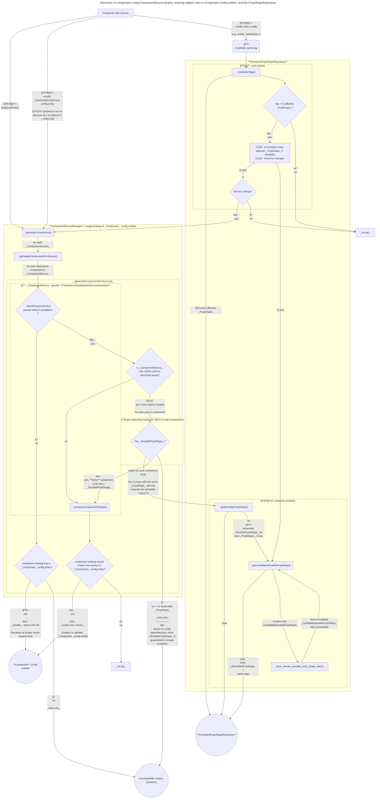

```mermaid
---
title: Discovery of components using ComponentSource plugins, tracking eligible ones in Component config entities, and the PropShapeRepository
---
flowchart TD
    Drupal[Drupal site with Canvas]
    Drupal --> |🧑â€ğŸ’»<br>install extension| genAll
    Drupal --> |🧑â€ğŸ’»<br>modify _JavaScriptComponent_ config entity<br><br>@TODO optimize to not re-discover ALL in #3561272 + #3561493| genAll
    Drupal --> |"🧑â€ğŸ’»<br>modify other config<br><br>(e.g. create _MediaType_)"|invalidateCacheTag

    %% ComponentSourceManager
    genAll("::generateComponents()")
    genForSource["::generateComponentsForSource()"]
    genForSource --> |for each discovered component in _ComponentSource_| discoveryCheckReqs

    %% ComponentCandidatesDiscoveryInterface
    discoveryCheckReqs{"::checkRequirements()<br>passes without exceptions<br>?"}
    discoveryComputeSettings("::computeComponentSettings()")
    isSourceWithPropShapes{is _ComponentSource_ with JSON-schema described props?}

    %% Component config entities
    Components(("**Component** config entities"))

    %% PersistentPropShapeRepository
    PropShapeRepository(("**PersistentPropShapeRepository**"))
    getStorablePropShape["::getStorablePropShape()"]
    getCandidateStorablePropShape("::getCandidateStorablePropShape()")
    hook_canvas_storable_prop_shape_alter["hook_canvas_storable_prop_shape_alter()"]
    getStorablePropShape --> |read| PropShapeRepository
    invalidateTags["::invalidateTags()"]
    invalidateTags --> |find every affected _PropShape_| PropShapeRepository
    getCandidateStorablePropShape --> |"âœï¸<br>write _(Storable)PropShape_<br>+<br>cache tags"| PropShapeRepository
    subgraph "**PersistentPropShapeRepository**"
        %% empty/hook_rebuild()/drush cr
        subgraph "ğŸ§©ğŸ•µï¸ compute storability"
            getStorablePropShape --> |"no<br>🆕<br>determine _StorablePropShape_ for new _PropShape_, if any"| getCandidateStorablePropShape
            getCandidateStorablePropShape --> |invokes with _CandidateStorablePropShape_| hook_canvas_storable_prop_shape_alter
            hook_canvas_storable_prop_shape_alter --> |returns modified _CandidateStorablePropShape_ with cacheability| getCandidateStorablePropShape
        end
        %% when not empty
        subgraph "🧩🔄 auto-update"
            invalidatedStorablePropShapes --> |✅<br>yes| recomputeAffectedPropShapes
            recomputeAffectedPropShapes[1ï¸âƒ£  re-compute every affected _PropShape_'s storability<br>2ï¸âƒ£  check for changes]
            invalidationChangedStorablePropShapes{Did any change?}
            recomputeAffectedPropShapes --> |2ï¸âƒ£| invalidationChangedStorablePropShapes
            recomputeAffectedPropShapes --> |1ï¸âƒ£| getCandidateStorablePropShape

            %%recomputeAffectedPropShapes --> regenBlindly["re-generate _Component_s blindly<br>(if no new settings, then no-op anyway)"]
            invalidateTags --> invalidatedStorablePropShapes
        end
    end
    invalidatedStorablePropShapes --> |â›”<br>no| invalidationNoOp
    invalidationChangedStorablePropShapes --> |✅<br>yes| genAll
    invalidationChangedStorablePropShapes --> |â›”<br>no| invalidationNoOp

    %% ComponentIncompatibilityReasonRepository
    ReasonRepository(("incompatibility reason repository"))

    %% (re)generating of `Component`s: flow -> subgraphs
    subgraph "**ComponentSourceManager**: (re)generating of _Component_ config entities"
        genAll
        genAll --> |for each _ComponentSource_| genForSource
        subgraph " _::generateComponentsForSource()_"
            subgraph "🔬 _ComponentSource_-specific **ComponentCandidatesDiscoveryInterface**"
                discoveryCheckReqs
                discoveryComputeSettings
            end
            componentAlreadyExists{component already has a _Component_ config entity?}
            discoveryCheckReqs --> |â›”<br>no| componentAlreadyExists
            discoveryCheckReqs --> |✅<br>yes| isSourceWithPropShapes
            isSourceWithPropShapes --> |🕵ï¸<br>yes: more checks needed<br><br>for each prop in component| checkEachProp
            subgraph "🧩 Shape matching checks for SDCs & code components"
                checkEachProp{has _StorablePropShape_?}
                checkEachProp --> |"called for each component prop<br><br>(but 2 props with the same _PropShape_ will only compute the storability **once**!)"| getStorablePropShape
                checkEachProp --> |✅<br>yes, **every** component prop has a _StorablePropShape_| discoveryComputeSettings
            end
            computedSettingsYieldNewVersion{"component settings would create new version in _Component_ config entity?"}
            isSourceWithPropShapes --> |no| discoveryComputeSettings
            discoveryComputeSettings --> computedSettingsYieldNewVersion

        end
    end
    %% (re)generating of `Component`s: results -> outside subgraphs
    componentAlreadyExists --> |"🚫<br>yes<br><br>âœï¸<br>_disable_: status=FALSE<br><br>(because no longer meets requirement)"| Components
    componentAlreadyExists --> |"â›”<br>no<br><br>_track why_"| ReasonRepository
    computedSettingsYieldNewVersion --> |"✅<br>yes<br><br>âœï¸<br>_create new version_<br><br>(creates or updates _Component_ config entity)"| Components
    computedSettingsYieldNewVersion --> |"â›”<br>no"| ComponentNoOp["_no-op!_"]
    checkEachProp --> |⛔<br>no, >=1 unstorable _PropShape_<br><br>_track why_<br>---------------<br>✨<br>thanks to config dependencies, every _StorablePropShape_ is guaranteed to remain available!| ReasonRepository

    %% Cache tag invalidations trigger PropShapeRepository update and Component (re)generation
    invalidateCacheTag(💥<br>invalidate cache tag)
    invalidateCacheTag --> invalidateTags
    invalidatedStorablePropShapes{has >=1 affected _PropShape_?}
    invalidationNoOp["_no-op!_"]

    %% Use an invisible link to force the 3 storages to be positione at the end.
    %% @see https://mermaid.js.org/syntax/flowchart.html#an-invisible-link
    Components ~~~ PropShapeRepository ~~~ ReasonRepository
```
Tip: copy/paste into <https://mermaid.live/edit> to edit and a nicer rendering!
